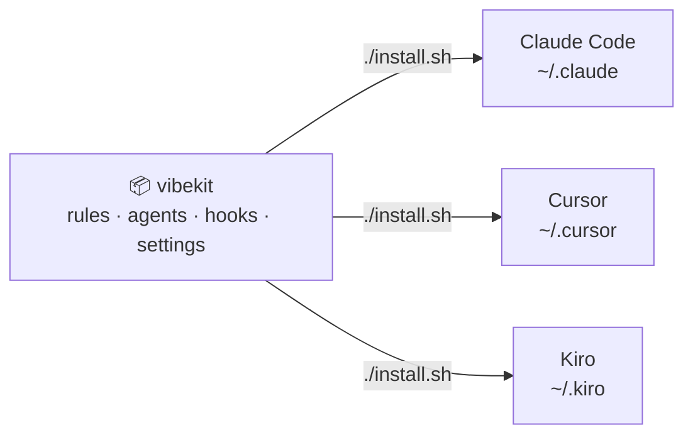
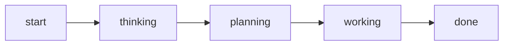

# vibekit

<p align="center">
  
</p>

<p align="center">
  <b>One configuration for every AI coding tool — versioned, synced, yours.</b><br>
  Set up Claude Code, Cursor, and Kiro the same way on every machine, with a single command.
</p>

<p align="center">
  <a href="https://github.com/timurgaleev/vibekit/releases"></a>
  <a href="LICENSE"></a>
  <a href="SECURITY.md"></a>
  <a href="https://github.com/timurgaleev/vibekit/stargazers"></a>
</p>

---

## What is this? (30-second version)

**If you use an AI coding assistant** (Claude Code, Cursor, or Kiro), vibekit is
the one place your settings live. Instead of re-configuring each tool on each
laptop by hand, you keep everything in this repo and run one command — and all
three tools behave the same way, everywhere. New machine? One command and you're
set up exactly like before.

**For engineers:** a versioned config repo that syncs `CLAUDE.md`, behavior
rules, sub-agents, status hooks, a custom statusline, and permissions into
`~/.claude`, `~/.cursor`, and `~/.kiro`. MD5-diffed, deep-merged so your local
tweaks survive, dry-runnable, no telemetry. Your config, in git, under your name.

> Think of it as dotfiles for your AI tools: edit once, commit, sync everywhere.

---

## Install in 30 seconds

```bash
# Clones the repo and syncs everything
bash -c "$(curl -fsSL timurgaleev.github.io/vibekit/install.sh)"
```

Already have the repo? Just run it — and preview first if you like:

```bash
./install.sh        # apply
./install.sh -n     # preview every change, write nothing
```

Open a new session of your tool and your rules, agents, and statusline are live.

> On a machine you care about, run `./install.sh -n` first to see the diff. See
> [`SECURITY.md`](SECURITY.md) for the full trust model.

---

## Why people use it

- 🧩 **One source, three tools.** Edit a rule once; Claude Code, Cursor, and Kiro all pick it up.
- 💻 **Same setup everywhere.** New laptop to fully configured in one command.
- 🛟 **Safe syncs.** Changes are previewable (`-n`) and merged so your local plugins and permissions survive.
- 🔒 **Yours, private.** No accounts, no telemetry. Everything lives on your machine and in your git repo.
- 🎛️ **Live feedback.** A custom statusline and an optional monitor show what your assistant is doing in real time.

---

## How it works

One repo, synced into whichever tools you use:



`install.sh` clones (or pulls) the repo, compares each file by hash, shows you
the diff, and copies the changes across. Settings are deep-merged, so your
locally enabled plugins and permission tweaks are never clobbered.

Your assistant's state shows up live, from first prompt to finished task:



---

## What's inside

| Piece | What it gives your assistant |
|-------|------------------------------|
| `CLAUDE.md` + `rules/` | Always-on guidelines: how to think, code, review, and which skill to use |
| `agents/` | Specialized sub-agents to delegate work (planner, reviewer, debugger, …) |
| Status hooks | Broadcast session state to the statusline and optional monitor |
| Statusline | Live bar: branch, model, tokens, cost, context usage |

**The rules that shape behavior:**

| Rule | Enforces |
|------|----------|
| `language` | Always respond in English |
| `style` | Code style and file organization |
| `git` | Commit format and PR process |
| `security` | Security best practices |
| `tests` | TDD workflow, 80% coverage target |
| `patterns` | API patterns and conventions |
| `perf` | Model-tier selection strategy |
| `obsidian` | Read project context from an Obsidian vault, suggest saves |
| `authorship` | No AI attribution; comments, commits, and PRs in your voice |
| `skills` | Routes each task to the matching [vibestack](https://github.com/timurgaleev/vibestack) skill (`/ship`, `/plan-eng-review`, …) |

Cursor gets the same rules as `.mdc` files; copy them into any project with
`cp -r ~/.cursor/rules .cursor/rules`.

---

## More

```bash
./install.sh -n     # preview, write nothing
./install.sh -V     # disable VibeNotif status hooks
./install.sh -M     # enable the Vibe Monitor desktop app
./install.sh -C     # install the optional Caveman skill
./install.sh -h     # all options
```

- [`docs/configuration.md`](docs/configuration.md) — statusline, Vibe Monitor, VibeNotif config, env vars, Cursor settings, Caveman
- [`SECURITY.md`](SECURITY.md) — trust model and how to tighten defaults
- [`CHANGELOG.md`](CHANGELOG.md) · [`LICENSE`](LICENSE) (MIT)
