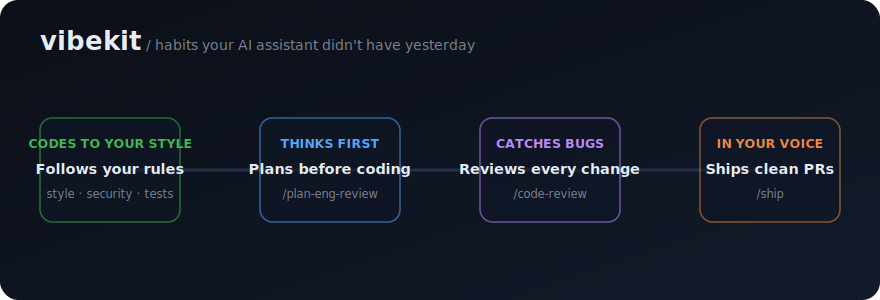

# vibekit

<p align="center">
  
</p>

<p align="center">
  <b>Give every AI coding tool the same good habits — your rules, your workflow, your voice.</b><br>
  vibekit configures Claude Code, Cursor, and Kiro to work the way you do, on every machine.
</p>

<p align="center">
  <a href="https://github.com/timurgaleev/vibekit/releases"></a>
  <a href="LICENSE"></a>
  <a href="SECURITY.md"></a>
  <a href="https://github.com/timurgaleev/vibekit/stargazers"></a>
</p>

---

## What is this?

**Non-technical version:** Out of the box, an AI coding assistant is a blank
slate — you have to re-explain how you like things every time. vibekit is the
set of standing instructions that makes the assistant *yours*: it learns your
rules once and applies them in every project, on every computer. Less repeating
yourself, more consistent results.

**For engineers:** a versioned config repo of `CLAUDE.md`, behavior rules,
sub-agents, status hooks, and a statusline that installs into `~/.claude`,
`~/.cursor`, and `~/.kiro`. No telemetry, no lock-in — your config, in git.

---

## What it does

vibekit changes how the assistant behaves. With it installed, your assistant:

- **Codes the way you do.** Your style, security, and testing standards are
  always on, so output matches your bar without re-explaining it each session.
- **Thinks before it types.** It plans and pressure-tests an approach before
  writing code, instead of guessing from a one-line prompt.
- **Catches problems early.** It reviews each change for bugs and security
  issues before anything merges.
- **Writes as you.** Commits and pull requests are in your voice — no
  "Generated by AI" tags, no assistant attribution.
- **Reaches for the right tool.** It routes each task to the workflow that fits
  — plan, debug, review, ship — instead of winging it.
- **Shows what it's doing.** A live statusline (and an optional monitor) tells
  you the model, cost, context use, and what stage it's in.

The result: the same senior-engineer habits in every tool, every repo, every
machine — without setting them up by hand each time.

---

## What's inside

Each piece teaches the assistant one kind of habit:

| Piece | What it does for you |
|-------|----------------------|
| `CLAUDE.md` + `rules/` | Always-on guidelines: how to think, code, review, and which workflow to use |
| `agents/` | Specialized helpers it can hand work to (planner, reviewer, debugger, …) |
| Status hooks + statusline | A live read on model, tokens, cost, context, and current stage |

**The rules that shape behavior:**

| Rule | What the assistant does |
|------|-------------------------|
| `language` | Always answers in English |
| `style` | Writes code in a consistent, readable style |
| `git` | Uses your commit format and PR process |
| `security` | Validates input, never logs secrets, least privilege |
| `tests` | Follows TDD and aims for 80% coverage |
| `patterns` | Reuses your API and code conventions |
| `perf` | Picks the right model tier for the task |
| `obsidian` | Reads project context from an Obsidian vault, suggests notes |
| `authorship` | Comments, commits, and PRs in your voice — no AI attribution |
| `skills` | Routes each task to the matching [vibestack](https://github.com/timurgaleev/vibestack) skill (`/ship`, `/plan-eng-review`, …) |

---

## Install

```bash
# Clones the repo and syncs everything
bash -c "$(curl -fsSL timurgaleev.github.io/vibekit/install.sh)"
```

In a clone, run `./install.sh` — or `./install.sh -n` to preview every change
first. Open a new session of your tool and the rules are live. On a machine you
care about, preview first and read [`SECURITY.md`](SECURITY.md).

---

## More

- [`docs/configuration.md`](docs/configuration.md) — statusline, Vibe Monitor, VibeNotif config, env vars, Cursor settings, Caveman
- [`SECURITY.md`](SECURITY.md) — trust model and how to tighten defaults
- [`CHANGELOG.md`](CHANGELOG.md) · [`LICENSE`](LICENSE) (MIT)
